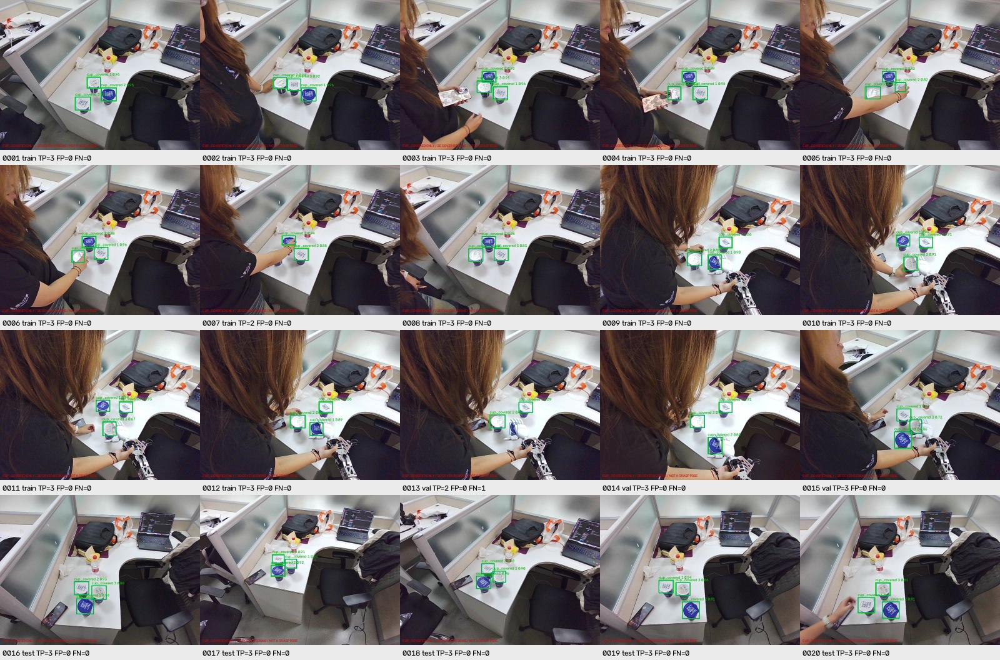
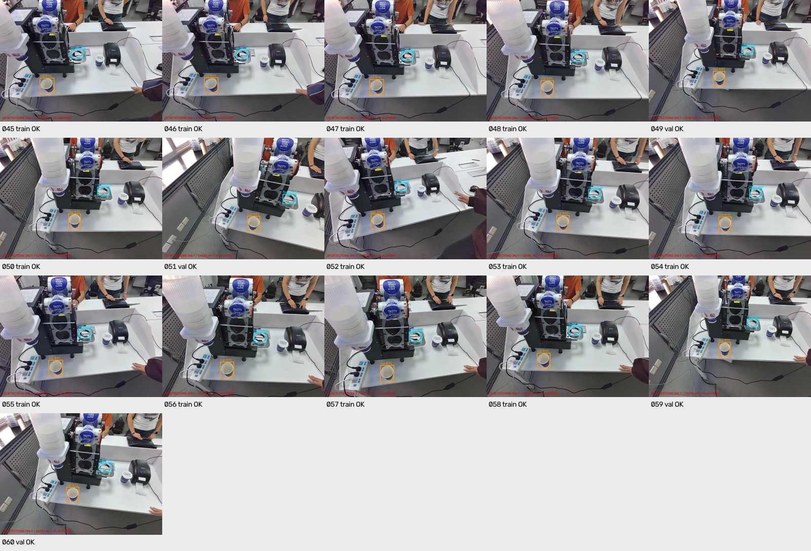
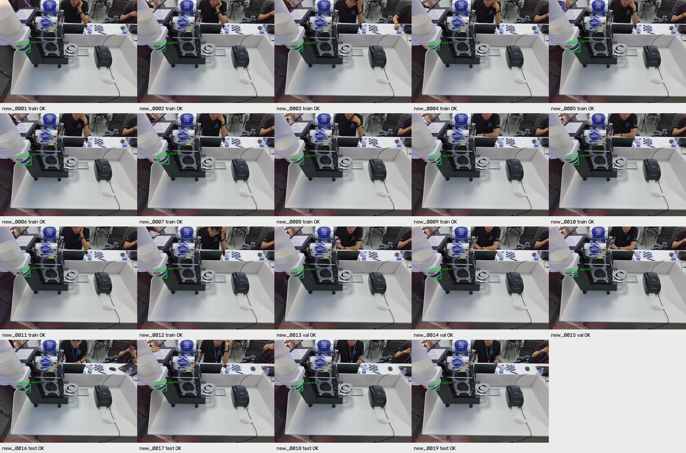
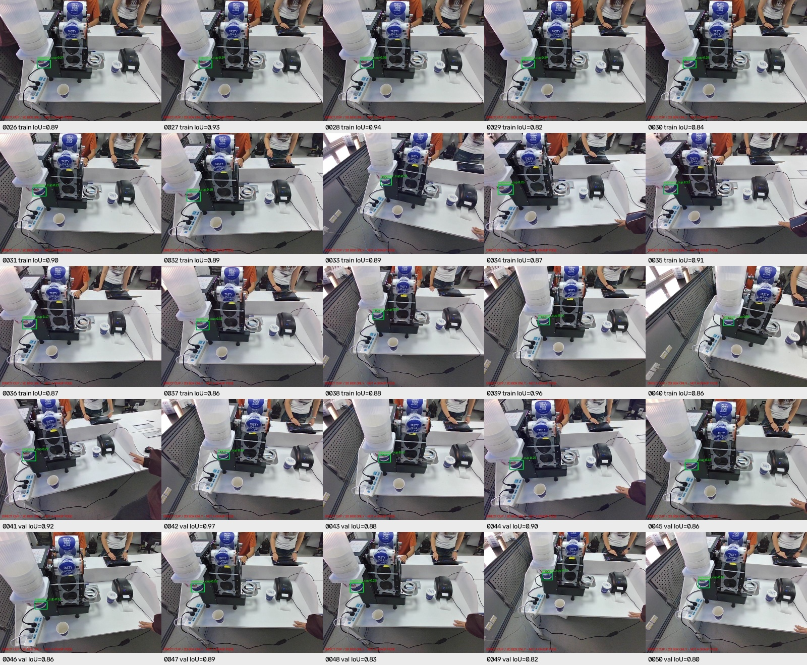

# CCF 杯子识别模型

## 任务二新增：独立 cup_covered 模型

[cup_covered v2 权重、识别入口与验证说明](artifacts/task2-cup-covered-yolo-v2-20261009/README.md)

- 单独检测人工标注的杯口封膜/盖面区域，仅一个类别 `cup_covered`，不是下方的 `cup` 或 `target`。
- 支持多个封膜杯同时检测；不合并、覆盖旧模型，也不自动选择抓取目标。
- 使用 20 张图片、59 个标注；完整原图回放检出 58/59，保留回归图检出 15/15。
- 已增加敞口杯和空杯托负样本；0013 严重遮挡目标仍漏检，少量离线检查不代表现场可靠性。
- 默认阈值 **0.40**，请配套使用该目录的 `recognize.py`、`runtime-config.json` 和 `.pt` / `.onnx` 权重。
- 不要把 `cup_covered` 的 class 0 当成原 `cup+target` 模型中的 class 0；按模型和类别名称区分。
- 本次仅发布到 GitHub，不更新另一台电脑，不修改机器人控制代码。

## 任务二：桌面杯子与封口机承杯环

[任务二 cup + target 模型与接入说明](artifacts/task2-cup-target-yolo-20261008/README.md)

- 使用 56 张有效手动标注训练，两类为 `cup` 和 `target`，直接检测、无需整机配准。
- 43 张训练、13 张分组开发验证；验证定位结果为 cup 13/13、target 12/13。
- 018 重叠场景的杯托框偏下、偏小，作为失败保留；不是已完全解决所有场景。
- 同时提供 `.pt` / `.onnx` 权重、识别入口、校验绑定的阈值配置和验证报告。
- 阈值 cup **0.20**、target **0.25**；不要与下方任务一权重或阈值混用。
- cup/target 两类框允许重叠，框重叠不代表已经放稳或封口成功。
- 仅输出二维检测；现场效果未验证，本次上传不修改另一台电脑或机器人控制代码。

## 任务一：杯筒出口露出的待取杯子

### 最新候选：v9 补充数据微调

[v9 模型、运行说明和验证结果](artifacts/cup-perception-v9-20261009/README.md)

- 合并 2026-10-09 新增的 19 张人工标注；仅检测露出的待取杯子，不匹配整台封口机。
- 新增 19 张原图回放 19/19，旧 50 张回归 50/50；新增数据中保留的 4 张测试图为 4/4。
- 保留测试图的 48 次图像变换为 46/48；两张目标缩小后的图片仍漏检，不代表任意视角稳定。
- 默认阈值 **0.30**；请将 `recognize.py`、`runtime-config.json`、`weights/` 配套使用，不沿用 v7 的阈值。
- 包含 `.pt` / `.onnx` 权重和对比报告，69 张原图的导出一致性检查通过。
- 同次采集的小样本离线结果，不是现场准确率；未自动更新另一台电脑，任务二保持不变。

### 历史版本：v7

[v7 直接杯子检测模型与运行说明](artifacts/cup-perception-v7-20261008/README.md)

历史版本：[v6](artifacts/cup-perception-v6-20261008/README.md) · [v5](artifacts/cup-perception-v5-20261008/README.md)

目标是杯筒下方待取杯子的蓝色露出部分及可见下沿，不是杯筒、支架或桌面杯子。

v7 是使用用户手动 YOLO 标注微调得到的 **YOLO11n 检测权重**，包含
`best.pt` 和 `best.onnx`。它直接检测露出的待取杯子，**不再匹配封口机**，
没有参考图、SIFT 或工位配准前置条件。

- 40 张用于训练，最后 10 张为开发验证；验证图 10/10 正确检出（IoU >= 0.5）。
- 去掉这 10 张图的机器背景、保留杯子邻域后，10/10 正确检出。
- 60 个验证侧合成变化、53 项合成负例/空白输入检查、9 项单元测试通过。
- 同次采集且开发验证参与最佳权重选择，不是独立现场准确率；现场效果未验证。
- 配套阈值为 **0.05**，仅使用训练侧样本选择。务必同时使用新版
  `recognize.py`、`runtime-config.json` 和权重；不要套用旧配准程序或 0.50 阈值。
- 输出检测框和框中心像素，**不是实际杯沿或三维抓取坐标**。
- 本次上传不修改虚拟机或另一台电脑，不包含机器人控制代码或完整原始数据集。

