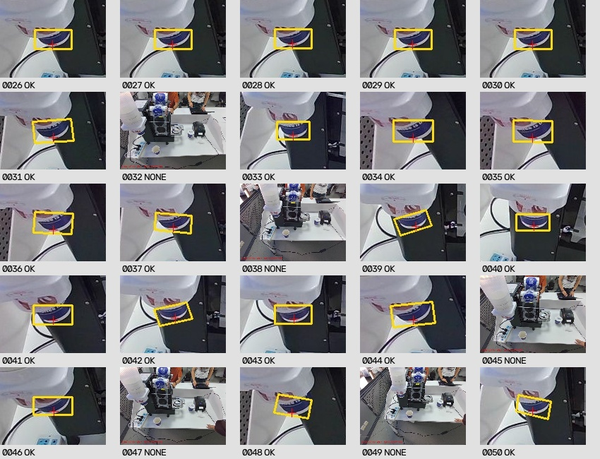

# CCF 杯筒出口识别结果

[2026-10-08 识别包与说明](artifacts/cup-perception-v5-20261008/README.md)

目标是杯筒下方待取杯子的蓝色露出部分及可见下沿，不是杯筒、支架或桌面杯子。

本次产物是 **多参考图匹配识别包，不是新训练的 YOLO 权重**。
使用 `CCF数据集-20261008-120100` 做开发适配，保留全部结果与失败帧信息。

- 开发回放 45/50 检出；固定视角前 30 帧为 30/30。
- 7 张参考图计入上述 50 帧；非参考图为 38/43，不是独立测试集。
- 54 项负例/输入检查、4 项连续帧状态单元测试通过。
- 仅二维候选点，没有可靠的三维抓取坐标或机器人控制接口。
- 本次上传不修改虚拟机，不包含机器人控制代码或完整原始数据集。

