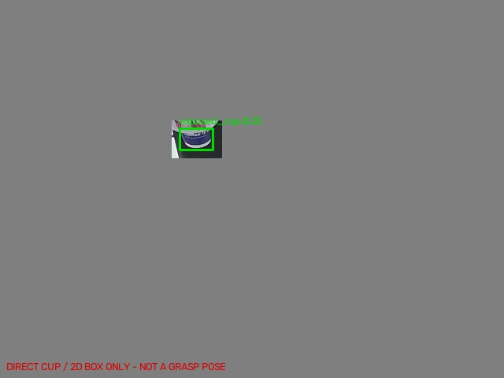

# v7：直接检测露出的待取杯子

本版使用用户 `labels_my-project-name_2026-10-08-06-42-01.zip` 中的
50 份手动标注，类别为 `exposed_cup`。目标是杯筒出口下方露出的杯体，
不是透明杯筒、白色支架、封口机或桌面杯子。

**算法不再匹配封口机。** 输入整张 BGR 图像，YOLO11n 直接输出目标框。
没有 SIFT、参考图库、工位单应性或固定位置兜底。置信度从与权重校验和
绑定的 `runtime-config.json` 读取；阈值仅用训练侧样本选择，不套用 0.50。
有多个候选时保留检测列表，但不选出唯一位置。

## 标注、训练与结果口径

- 原始标注逐份验证，没有使用旧算法输出替代用户标注。
- 使用通用 COCO 预训练 `yolo11n.pt`，没有使用旧螺母或杯筒任务权重。
- 0001–0040 用于训练，0041–0050 为连续保留的开发验证；前 30 张相近
  帧均留在训练侧。仍属同次采集，存在相近视角，不能代表独立现场准确率。
- 训练增加 40 张仅保留杯子邻域的正例，以及 20 张人工遮掉杯子的负例。
  全部增强只来源于训练帧；原图和用户标注不修改。
- 用开发验证选择 best.pt，因此这 10 张不是最终独立测试集。
- 模型的原始置信度不是准确概率；最佳框定位 checkpoint 的分数偏低，
  原样设置 0.50 会漏检。`threshold-calibration.json` 保留训练侧阈值扫描；
  缺少真实负例，低阈值对未见场景的误报风险仍需要现场验证。
- `verification.json` 按 IoU >= 0.5 统计与手工框重叠的正确检测，分别列出
  训练回放、开发验证、机器背景移除、亮暗/压缩/模糊/平移和合成负例。
- 这不是对空杯筒、机械手遮挡、其他相机或现场光照变化的全面验证。

## 单张图像运行

使用安装了 requirements.txt 中依赖的 Python 环境，在本目录执行：

```bash
python recognize.py /path/to/current-full-frame.jpg \
  --output preview.jpg --json-output recognition.json
```

默认加载 `weights/best.pt` 和 `runtime-config.json`，不打开相机、不启动
ROS、不发送机器人命令。不要只拷贝权重而漏掉相应阈值配置。
相机序列号可通过 `--camera-serial` 记录，但不再作为图像匹配的门槛。
支持有效 uint8 BGR 图像；内部缩放推理，返回坐标对应输入原图。
640×480 是训练分辨率，其他相机与分辨率的效果没有验证。

## 本次本机验证结果

- 训练 27 轮后早停，采用第 9 轮的最佳定位权重。
- 训练侧阈值选择结果为 **0.05**，已写入 runtime-config.json；这是该权重
  的工作阈值，不是“只有 5% 准确率”，也不能视作已验证的现场误报率。
- 50 张原图均检出且与人工框 IoU >= 0.5，无额外检测；其中 40 张是训练
  回放，10 张是开发验证，必须分开理解。
- 10 张开发验证去掉机器背景、只保留杯子邻域后，10/10 正确检出。
- 验证侧 60 个合成变化（背景移除、亮暗、模糊、压缩、平移）正确检出；
  53 个合成负例/空白输入检查通过。没有真实空杯筒场景测试。
- 9 项运行接口/连续帧边界单元测试通过。
- 本版本已作为独立识别包发布，保留仓库中的 v5/v6；没有修改另一台
  电脑的运行程序，现场实时效果仍未验证。

另提供 `weights/best.onnx`（固定 1×3×640×640 输入、输出 1×5×8400，
无内置 NMS）。独立接入需要正确的等比例 letterbox、BGR→RGB、/255、
xywh→xyxy、阈值过滤及 NMS，不能直接把输出当最终坐标。
在当前 Python 入口使用 `--weights weights/best.onnx` 需额外安装
`onnxruntime`；`export-verification.json` 记录两种格式的逐帧一致性。

## 接入实时发布器

```python
from recognize import Detector, StabilityGate, annotate

detector = Detector()  # 每个工作线程单独创建；不要每帧加载权重
gate = StabilityGate()
# frame_bgr、frame_id、observed_time 来自真实的新采集帧
result = detector.predict(frame_bgr, camera_serial)
result = gate.update(result, frame_id, observed_time)
preview = annotate(frame_bgr, result)
```

`candidate_valid_2d` 表示存在唯一检测框；`cup_bbox_xyxy_px` 为原图框，
`cup_center_uv` / `visible_cup_center_uv` 为框中心像素。
`stable_2d` 仅在连续三张新帧的框中心稳定时为真，不代表三维抓取可用。

**与 v5/v6 的重要区别**：`visible_lower_rim_uv` 保持 null。用户只标了
矩形框，不能把框中心或框底边中心伪装成实际观察到的杯沿点。
旧发布器如只读取 `visible_lower_rim_uv`，应改为画 `cup_bbox_xyxy_px`，
需要显示目标中心时读取 `cup_center_uv`。旧版 StabilityGate 不可混用。
本版没有 `references` 或参考清单，请移除发布器中对它们的读取。
不要仅替换权重却继续调用 v5/v6 的工位配准路径。

深度未对齐且机器人外参未验证，三维坐标、`grasp_pose` 仍为 null，
`robot_motion_ready=false`。本版仅用于识别和观测，未修改另一台电脑。

## 复现

```bash
# prepare.py 在 dataset 已存在时拒绝覆盖；在新的包副本中重新准备。
python prepare.py --data /path/to/CCF数据集-20261008-120100 \
  --labels /path/to/labels_my-project-name_2026-10-08-06-42-01.zip
python train.py --pretrained /path/to/yolo11n.pt --epochs 60
# 把选出的 runs/direct-cup/weights/best.pt 复制为 weights/best.pt 后：
python calibrate.py
python evaluate.py --data /path/to/CCF数据集-20261008-120100 \
  --weights runs/direct-cup/weights/best.pt
python -m unittest test_runtime -v
```

训练使用 CPU（本机 NVIDIA 驱动不可用），没有调整系统驱动。
`training-args.yaml` 保存实际训练参数，其中本机绝对路径已改为可移植
占位路径；复现请使用 train.py 并提供实际的预训练权重路径。
`annotation-audit.json` 记录标注压缩包和每张图片的 SHA256、手工框及分组。
`manual-labels-*.jpg` 是人工标注检查图；`full-frame-grid-*.jpg` 用完整原图
显示回放结果，蓝框为人工标注，绿框为模型检测，不混用局部放大图。


